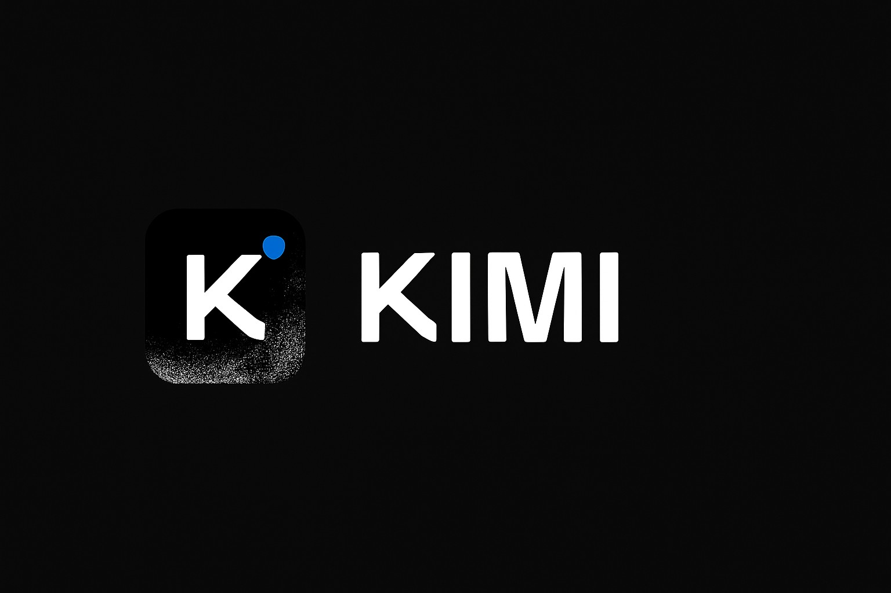

<p align="center">
  
</p>

<h1 align="center">Kimi Desktop for Ubuntu 26.04+</h1>

<p align="center">
  
  
  
  =1.85"/>
  =22"/>
  
  
</p>

<p align="center">
  Native desktop app for <a href="https://kimi.moonshot.cn">Kimi</a> (Moonshot AI),<br/>
  rebuilt for Ubuntu 26.04+ using <a href="https://github.com/tw93/Pake">Pake</a> v3 with Tauri v2.
</p>

---

## Why this exists

The official Kimi desktop `.deb` (from [kimi-moonshot](https://github.com/kimi-moonshot/kimi-moonshot)) is built with Tauri v1, which hard-links `libwebkit2gtk-4.0.so.37`. That library was dropped from Ubuntu after 22.04 — so the official package fails to install on Ubuntu 24.04+ and 26.04 with missing dependency errors.

This rebuild uses **Tauri v2**, which links against `libwebkit2gtk-4.1` (the current version shipped in Ubuntu 24.04+ and 26.04).

## Features

| | Feature | Detail |
|---|---|---|
|  | **Modern runtime** | Links against `libwebkit2gtk-4.1` instead of the removed `4.0` |
|  | **OAuth / SSO support** | `--new-window` so Google and other OAuth providers work in-app |
|  | **System tray** | Enabled for Linux desktop integration |
|  | **Native window** | Matches original Kimi desktop dimensions |

## Download

Grab the latest `.deb` from [GitHub Releases](https://github.com/johnohhh1/kimi-app/releases).

```bash
sudo dpkg -i kimi_1.0.0_amd64.deb
```

Or rebuild from source (see below).

## Rebuild from source

Prerequisites:

```bash
# Rust (>= 1.85)
curl --proto '=https' --tlsv1.2 -sSf https://sh.rustup.rs | sh

# Node.js (>= 22)
# Use your preferred method (nvm, brew, etc.)

# Linux build dependencies
sudo apt install libwebkit2gtk-4.1-dev libgtk-3-dev libayatana-appindicator3-dev librsvg2-dev

# Pake CLI
npm install -g pake-cli
```

Then:

```bash
./build.sh
```

The built `.deb` will be in `dist/`.

## Configuration

The Pake build configuration is in `config/pake.json`. Key settings:

| Setting | Value | Why |
|---|---|---|
| `url` | `https://kimi.moonshot.cn` | Kimi web app |
| `new_window` | `true` | Enables OAuth popups (Google auth) |
| `width` / `height` | 1200 / 780 | Matches original Kimi desktop |
| `user_agent.linux` | Chrome 133 on Linux | Makes OAuth providers accept the webview |

## Uninstall

```bash
sudo dpkg -r kimi
```

## License

Kimi is a product of [Moonshot AI](https://moonshot.cn). This packaging uses the open-source [Pake](https://github.com/tw93/Pake) tool (MIT license) to wrap the Kimi web interface as a native desktop application.